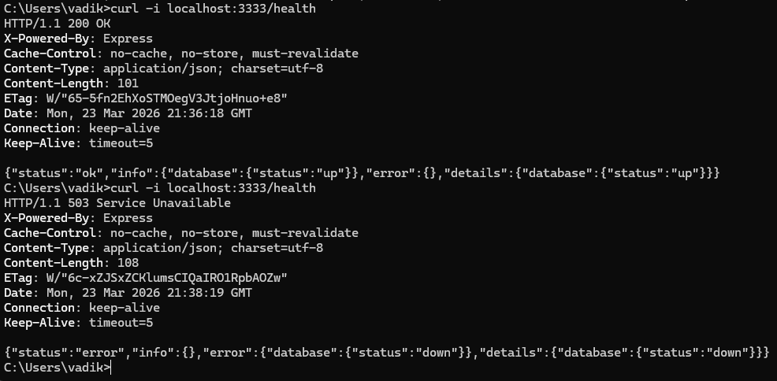
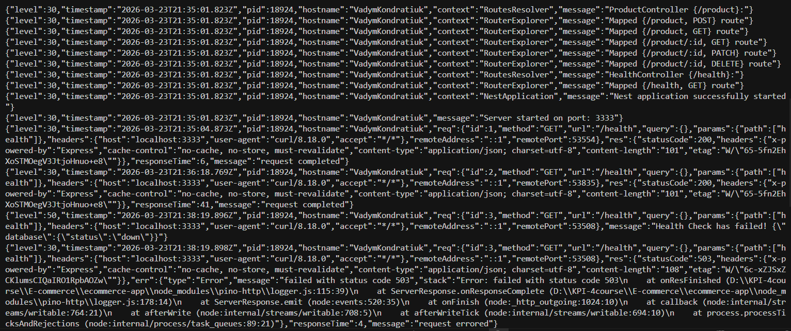
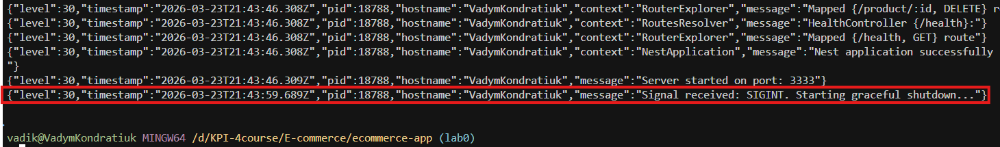

# Лабораторна робота №0: Підготовка застосунку — Readiness & Standardization

## Фаза 1: Обов'язкові вимоги (Рівень 1)

### 1. Збірка однією командою (One-Command Build)
Для встановлення залежностей та запуску юніт-тестів застосовується стандартний менеджер пакетів `npm`.
Команда для запуску тестів:
```bash
npm run test
```

### 2. Конфігурація через середовище (12-Factor App)
Застосунок відповідає принципам 12-Factor App. Усі чутливі дані та конфігурації винесені зі сирцевого коду у змінні оточення.

**Необхідні змінні оточення (`.env`):**
```env
PORT=3333

DB_HOST=localhost
DB_PORT=5432
DB_NAME=your_db_name
DB_USER=your_db_user
DB_PASSWORD=your_secure_password
```

### 3. Автоматичне керування схемою БД
Проект використовує **TypeORM** для керування базою даних. 
Під час запуску застосунку система автоматично перевіряє стан бази даних і застосовує всі наявні міграції, усуваючи необхідність ручного запуску SQL-скриптів.

---

## Фаза 2: Production-Grade фічі (Рівень 2)

### 1. "Глибока" перевірка стану (Dependency-Aware Health Checks)
Реалізовано ендпоінт `GET /health` за допомогою `@nestjs/terminus`. Застосунок перевіряє не лише свою доступність, а й успішність з'єднання з базою даних.

* **БД підключена — статус 200 OK та БД недоступна — статус 503 Service Unavailable:**
    

### 2. Структуроване логування в JSON
Для забезпечення сумісності з системами збору логів (ELK, Datadog тощо) інтегровано `nestjs-pino`. Логи виводяться у форматі JSON із дотриманням обов'язкових полів (`timestamp`, `level`, `message`/`context`).

* **Приклад реальних логів:**


### 3. Плавне завершення роботи (Graceful Shutdown)
Застосунок коректно обробляє сигнали завершення роботи (наприклад, `SIGTERM`, `SIGINT`). При отриманні сигналу сервер припиняє прийом нових HTTP-запитів і безпечно закриває всі з'єднання з базою даних.

* **Graceful Shutdown у логах:**
    